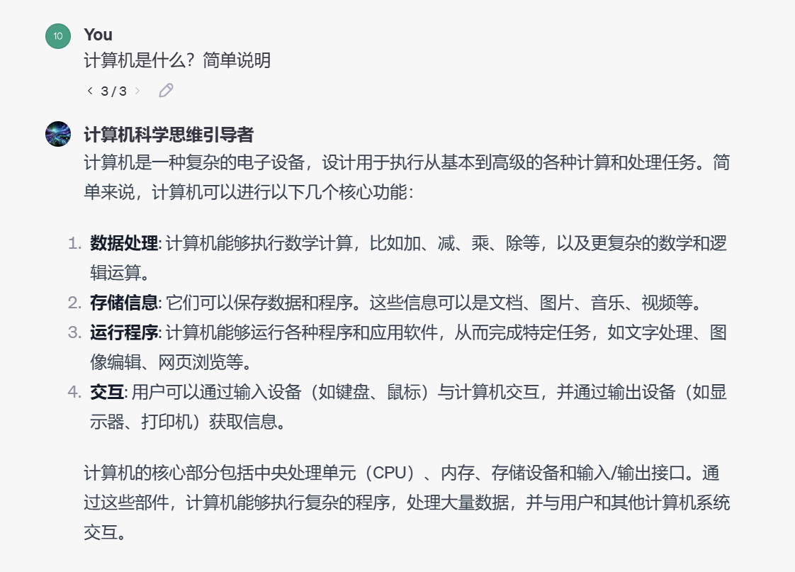

# 计算机的前世今生

## 一、计算机是什么

### 大学老师说

计算机的核心部分包括中央处理单元（CPU）、内存、存储设备和输入/输出接口。通过这些部件，计算机能够执行复杂的程序，处理大量数据，并与用户和其他计算机系统交互。（听困了...）



### 毛毛熊说

计算机就是`处理输入返回输出`的黑盒子！


宏观上看

输入：键鼠、喇叭、触摸屏...
输出：图像、声音...
黑盒子：意味着普通人不需要关心它内部是怎样实现的

**计算机专业，就是去研究怎么设计这个黑盒子的**

其实黑盒子内部也是由一个个黑盒子组成的（“老师我懂了，里面的黑盒子有 4 个！”啪！）


黑盒子用专业一点的词语啊，叫做`抽象`

- 软件抽象，如函数、模块，（经常听到别人说，调包侠调这个库啊调这个包，就是别人封装好的代码直接用）
- 硬件抽象，如 CPU、内存、显卡等等（经常听到别人说，选择哪个 cpu，哪个显卡啊……硬件抽象允许软件开发者在不需要了解硬件复杂细节的情况下进行编程）

> 例子：如果我们回到一百年前没有计算机的年代，你想要看毛毛熊的视频...**毛毛熊接待不过来啦！**
>
> ```mermaid
> graph LR
> A[输入: 视频URL] -->|请求视频| B[黑盒子 1: 浏览器]
> B -->|请求处理| C[黑盒子 2: DNS服务器]
> C -->|IP地址响应| D[黑盒子 3: Bilibili服务器]
> D -->|视频数据流| E[输出: 视频播放]
>
> subgraph 计算机系统
> B
> C
> D
> end
>
> style 计算机系统 stroke:#333,stroke-width:2px
>
> ```

相比物理化学生物这些是`研究自然规则`的学科。计算机学科，很大程度上是`人为创造规则`。随着学习的深入，你会发现`人为创造规则`贯彻到计算机的方方面面。我们设计和构建算法、程序语言、操作系统等等，这些都是基于人为定义的规则和逻辑体系，而非自然规律。**大胆点说，计算机就是人类在创造一个属于自己规则的世界！**

## 二、计算机诞生

### 艾伦·麦席森·图灵（1912年6月23日~1954年6月7日）


英国计算机科学家、数学家、逻辑学家、密码分析学家、“计算机科学之父”、“人工智能之父”

1950年10月，图灵发表了一篇题为《计算机器与智能》的论文，首次提出机器具备思维的可能性。他在其中提出了一个被称为“[图灵测试](https://baike.baidu.com/item/图灵测试/1701255?fromModule=lemma_inlink)”的概念：如果一台机器输出的内容和人类大脑别无二致的话，那么我们就没有理由坚持认为这台机器不是在“思考”。

> 图灵从小就是一个数学天才
>
> - 15 岁时，图灵为了帮助母亲理解爱因斯坦的相对论，写了爱因斯坦的一部著作的内容提要。
>
> - 24 岁时，图灵发表了改变世界的一篇论文《论可计算数及其在判定问题上的应用》。不要问我这是什么，因为我也不知道。重要的是，这篇论文的副产品，图灵提出了一种计算模型，改变了世界，从此之后你再也不需要到毛毛熊家里来学资料了哦。简单组成如下：
>
>   1. **无限长的纸带**：可以写入和读取信息的地方。
>   2. **读写头**：可以在纸带上读取信息和写入信息，就像笔一样。
>   3. **一套规则**：告诉读写头在看到特定信息时该做什么，比如左移右移读写头，改变状态。
>   4. **当前状态**：记录机器目前处于什么状态，工作状态呢还是终止状态。
>
>   （“这么简单，我也会！”哎呀人家图灵是给出了严格的数学定义）
>
>   后人为了纪念图灵，把这个模型成为图灵机。
>
>   图灵机是一个极其简化的模型，但它强大到足以模拟任何现代计算机的计算过程。也就是说，**任何可以用现代计算机来解决的问题，本质上都可以转换为图灵机来解决！**
>
>   

### 冯诺依曼


“现代计算机之父” （8 岁掌握微积分...我 8 岁还在打 4399 奥比岛摩尔庄园呢...）

在图灵机的基础上，冯诺依曼提出了三点开创性理论：

- 确定了现代计算机的体系结构——即`冯诺依曼结构`

  

  我靠，抄袭毛毛熊第一张是吧！有没有可能，是我抄袭他的。

- 提出计算机应采用二进制编码

- 提出计算机需要存储程序、按照程序进行工作（这是软件编程的理论基础，而之前让计算机工作是通过插拔电线）

现代任何计算机的软件、硬件，底层实现全是按照他的指示，当之无愧的“现代计算机之父”

因此也有人说，**图灵机是现代计算机的灵魂，冯诺依曼架构是这个灵魂的载体和实现**。

## 三、计算机的局限

如果一种语言或者模型能够实现图灵机的所有计算功能，那么称此语言或模型为 **图灵完备**。如果一个系统或语言是图灵完备的，那么理论上它能够解决所有可计算的问题！

> 举例：Minecraft 的红石电路是图灵完备的，这意味着你可以在 Minecraft 里搭建计算机跑一个另一个 Minecraft！
>
> [纯原版红石｜耗时七个月，真正的 MC 里玩 MC！*哔哩哔哩 bilibili*我的世界](https://www.bilibili.com/video/BV1ND4y1q75w/?spm_id_from=333.337.search-card.all.click&vd_source=95f170cf9885fc59502f626f2ff81aa9)
>
> [康威生命游戏是如何搭建计算机的？ - 知乎 (zhihu.com)](https://zhuanlan.zhihu.com/p/144162012)

在实际应用中，大多数的编程语言（如 Python、Java、C++、TS）都是图灵完备的。这意味着只要给定足够的时间和资源，这些语言可以用来编写能解决几乎任何**计算问题**的程序。

### 可计算问题的举例

- 给定一个正整数 n，判断它是否是质数
- 给定一个字符串，判断某个字符是否存在
- 《原神》通过物理引擎计算物体之间的运动、碰撞等。

### 不可计算问题的例子

- **非计算问题**：很多问题本质上不是计算问题。比如，道德判断、艺术创作、情感表达等领域，这些问题需要人类的直觉、情感和主观判断，目前计算机还无法处理这类问题。

  > 举例：毛毛熊是不是帅哥？今天吃什么饭捏？JS/TS 是世界上最好的语言！等等……

- **复杂性理论**：即使某些问题在理论上是可计算的，它们的解决方案可能需要非常长的时间或者巨大的计算资源。这类问题被称为`NP-hard`问题，找到最优解所需的时间和资源呈指数级增长。可能需要超出当前人类科技的计算能力。（量子计算机？）

- **可计算性**：在理论上，有些问题是不可计算的，这意味着没有任何算法能够解决这些问题。最著名的例子之一是`停机问题（Halting Problem）`：一个程序能否判断另一个程序是否会停止运行？“我们能不能编写一个程序，这个程序能检查任何其他程序是否会永远运行下去，还是最终会停止？” 1936 年，艾伦·图灵证明了这样的程序是不存在的。

## 四、图灵的故事（续）

> - 二战时，德军用一种叫 Enigma 的机器加密通信，如果要暴力破解，组合数高达 58,962,555,217,826,360,000 种，即使用现在的计算机也要跑一年。而图灵发明了解码器，用机器对抗机器，破译了德军 90%以上的电文。硬生生让二战提前两年结束，拯救了上千万人的生命。
> - 天妒英才，图灵的同性恋身份，触碰了当时英国保守社会的禁忌。1952 年，图灵因此被判处「严重猥亵罪」。公审后他被给到两个选择，**坐牢**或者**化学阉割**，也就是注射雌性激素。坐牢丧失工作和思考的自由，而「治疗」会让他丧失情感的能力。**在理性和感性的抉择中，图灵选择保留理性，接受化学阉割**。
> - 无法想象图灵经受了怎样的精神和身体的折磨... 1954 年 6 月 7 日，图灵被发现死于家中的床上，床头还放着一个被咬了一口的苹果。警方调查后认为是剧毒的氰化物中毒，调查结论为自杀，当时图灵年仅 41 岁...
> - 2009 年，英国首相`戈登布朗`代表政府向图灵道歉，他说英国对图灵亏欠了太多。
> - 2013 年圣诞前夜，英国女王`伊丽莎白二世`宣布赦免图灵的罪名。（然而，我并不觉得他需要谁的赦免，也没有谁有资格赦免他。）
> - 2014 年图灵的故事在被拍成电影，叫做`《模仿游戏》`
> - 2021 年 6 月 23 日，图灵的 109 年诞辰，英国发行了新版最大面值的 50 英镑纸币，正面是女王，背面是图灵。
> - 英国也树立起很多他的纪念碑，其中在`曼彻斯特`一个公园里的纪念碑上写着：
>
> `艾伦·图灵，计算机科学之父、数学家、逻辑学家、战时密码破译者、偏见的受害者`
>
> 
