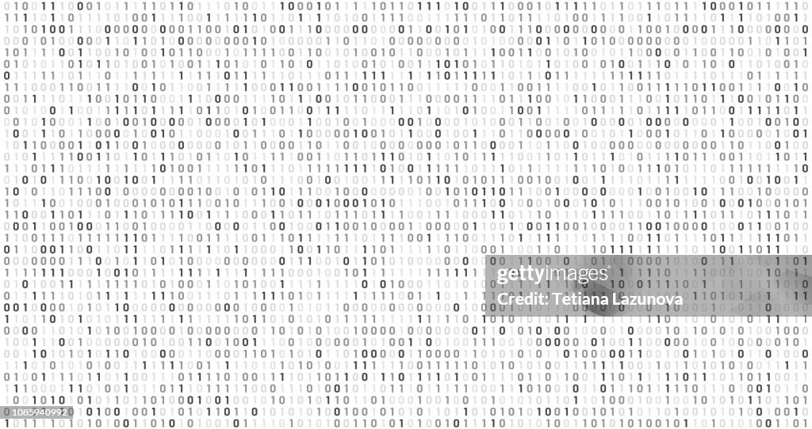
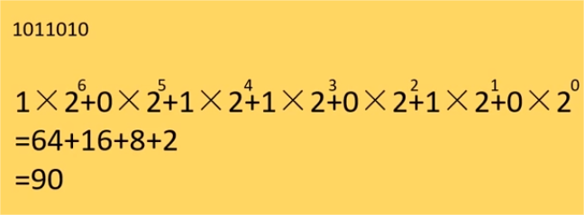
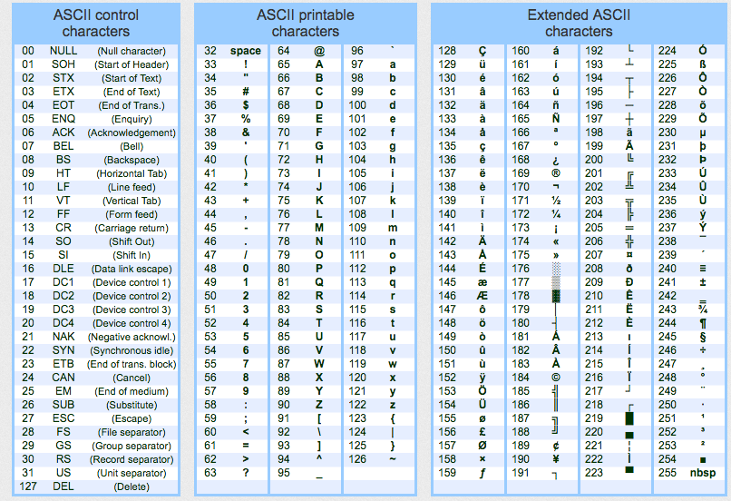
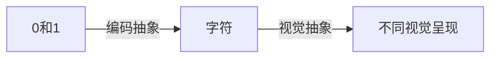
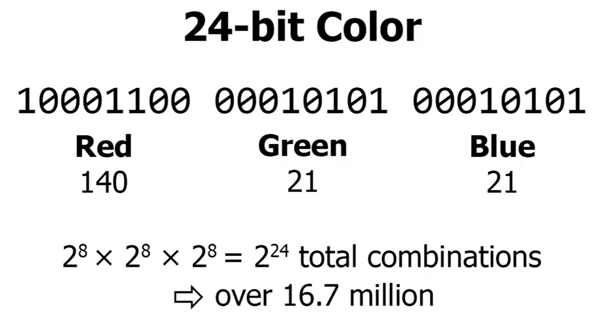

# 二进制（Binary）

> 可能很多人都听说过，计算机它只认识 0 和 1。有没有人觉得这不太好理解呢，为什么呢？
>
> 所有的视频也好，音频也好，图片也好。包括你现在看到的小毛毛熊的视频，小毛毛熊发出的声音。我在你电脑或者手机里也是以 0 和 1 的形式呈现的，只不过你的计算机把这些 0 和 1 做了好几层的抽象，你不需要关心我在你的电脑里是0000111 还是 1111001，计算机会自动将这些01转换成小毛毛熊的画面和声音。
>
> 你说，啊？毛毛熊到底是 0 还是 1？啪，想什么呢，不是你想的那种 0 和 1。

0和1是一种进制，叫二进制，只使用两个数字：0 和 1。

## 一、为什么计算机使用二进制

### 做个点名小游戏

> 假设大家都是线下来听毛毛熊的课。我现在呢，要点名啊，但是我忘了带纸和笔。我只能用 5 根手指头来点名，并且
>
> - 1、2、3、4、5，通常情况下点名发现就能点 5 个同学。
>   有些同学说哪有，我可以 6 8。那也就再点名2个同学而已啦，有的同学说这个是7，但是它和8一样。那所以我们能表示多少个同学呢
> - 采用二进制点名，最多能点 32 个同学！

为什么计算机采用二进制呢？

> 其实很直观：计算机内部是电路吧，电路是不是有两种状态，要么有电，要么没电。计算机内部的基础硬件——晶体管，可以很容易地以开（1）和关（0）的状态来表示和处理这两个数字。这比处理十进制系统（0 到 9 的数字）要简单得多。

### 二进制和十进制的转换

## 二、比特（Bit）和字节（Byte）

### 比特（Bit）

比特是`二进制数字`（Binary Digit）的缩写，它是信息的最小单位。一个比特可以是 0 或 1。

比特是衡量信息的基本单位。在计算机中，每个操作和数据存储都是通过大量比特来完成的。

### 字节（Byte）

一个字节由 8 个比特组成。（人类制定的规则）

聪明的小伙伴问了为什么是 8 个比特？其实一开始并不是 8 个 bit 组成一个字节，后续说明。

> 不知道大家是否很熟悉这个字节，我们可以看到各种文件的大小，B、KB、MB、GB、TB，经常下小电影的朋友估计对这些转换都非常了解~
>
> 1Byte（字节）=8Bit（比特） 
>
> 1 KB = 1024 B（字节）
>
> 1 MB = 1024 KB 
>
> 1 GB = 1024 MB 
>
> 1TB = 1024GB

## 三、字符编码

> 既然计算机内部是010101，我发一串`1111000`给你，你肯定看不懂是吧，别人会说你有病病。但是 0 和 1 怎样变成我们看到的文字呢？
>
> 对应关系？映射！太聪明了！

### ASCII（American Standard Code for Information Interchange）

ASCII 是计算机系统中最早采用的字符编码之一（又是人类制定的规则！）

1. 控制字符：ASCII的前32个字符（从0到31）是控制字符，用于控制文本的流和数据的处理。例如，字符10代表换行（LF），字符13代表回车（CR）。
2. 可打印字符：从字符32到126的字符是可打印字符。这包括英文字母（大写和小写）、数字（0-9）、标点符号以及一些特殊符号。
3. 扩展ASCII：在标准的128个ASCII字符之外，有一个被称为“扩展ASCII”的部分，它包含了额外的128个字符（从128到255）。这部分包含了一些额外的符号、特殊字符和非英文字符。

> 所以为什么一个字节要定义为 8bit，和第一套编码是 8 个 bit 有关系捏！8 个比特能够提供足够的组合（2^8=256 种）。
>
> 其实一开始有 6 个字节 7 个 Bit 为一个字节的，最后大家还是统一用 8bit 代表一个字节。

### Unicode

> 人类很快就发现 ASCII 码不够用了，它只有 8 位，只能表示最多 256 个符号，全世界这么多非英语母语国家表示强烈谴责！于是就有了 `Unicode`（万国码）

utf-8 是其中一种实现方式，也是大家现在最常见的编码啦！它能表示全世界的所有符号，甚至包括 emoji！

> 举例：打开记事本，看看右下角是什么编码捏！然后输入一下一些字符！
>
> 让 GPT 写一份代码将其在内存的01表示读出来！！！

### 🐻🐻🐻 不同系统、不同软件的 emoji 为什么看起来不一样捏 🐻🐻🐻

因为渲染标准不同，虽然是同一个符号编码，同一串 0 和 1

- 0 和 1：在计算机中，一切数据都以二进制形式存在，字符也是。
- 编码抽象：二进制代码通过某种编码系统（如 ASCII、Unicode）被转换成特定的符号。例如 ASCII 中 `1111000` 的字符为 `x`
- 视觉抽象，指的是根据不同平台或软件对字符进行视觉设计的过程

## 四、RGB

> 现在文字符号可以呈现了，但是图片怎么呈现呢？
>
> 不知道大家有没有水滴撒到手机屏幕上，其实水滴就是个放大镜，仔细观察就会发现：
>
> 

RGB：红绿蓝三原色，可以通过不同比例叠加出任意颜色

一个字节表示有多少红色，一个字节表示有多少绿色，一个字节表示有多少蓝色。

> 举例：微信截图工具、各种软件的取色器、vscode 颜色值

总共能表示`1670万`种颜色！

### 为什么 png 格式就要比 jpg 格式大呢？

因为它需要额外的空间来存储透明度！

RGBA 是一种色彩空间的模型，由 RGB 色彩空间和 Alpha 通道组成。

### 那视频是怎样保存的捏？

一个一个像素就组成了图片。视频其实就是图片的组合。

你的眼睛短时间处理不过来就以为是动态图！我们通常说的帧率越高，越丝滑！

> 视频就是图片的集合、图片就是颜色的集合，颜色是 bit 的排列，bit 就是电脑中的晶体管不停的开合关。
>
> 所以你们发现了没，通过不断地抽象，其实你们正在观看的毛毛熊视频，在计算机底层其实就是由 0 和 1 组成的！
