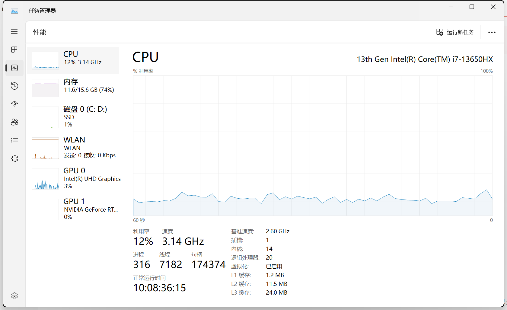

# 计算机组成

## 一、计算机的硬件组成

> 我们有了冯诺依曼的指导之下，怎么做一台计算机呢？请看 VCR：[《装机速成指南》\_哔哩哔哩\_bilibili](https://www.bilibili.com/video/BV1kj41117Mx/?spm_id_from=333.788&vd_source=95f170cf9885fc59502f626f2ff81aa9)

### 1.CPU（Central Processing Unit 中央处理器）

> 举例：打开任务管理器！
>
> 

- 基准速度：2.6GHz

  时钟频率越快，意味着运算速度越快，性能越强！2.6GHz 可以理解为：CPU 每秒可以切换其晶体管状态 26 亿次！

  为什么现在的速度大于 2.6Ghz 呢，因为 CPU 厂家会安全的帮我们“超频”。

- 插槽：1

  指物理 CPU 数，就是主板上实际插入的 CPU 硬件个数。

- 内核：14

  一开始，每个物理 CPU 上只有一个核心。为了提高性能，CPU 厂商开始在单个物理 CPU 上增加核心，也就出现了双核、四核多核。比如我这台笔记本是 14 核。

- 逻辑处理器：20

  一开始，一个核心只有一个线程。为了提高性能，CPU 厂商采用`超线程技术`，其将每个内核又可以处理 1、2 个线程。关于线程在操作系统后面会讲哦。

> 常见 CPU 厂商：（你的笔记本上贴贴纸）
>
> - Intel（英特尔）：Intel Core（酷睿）系列，也就是会看到的 Core i5、Core i7、Core i9 等等
>
> - AMD：AMD Ryzen（锐龙）系列，Ryzen 5、Ryzen 7、Ryzen 9

### 2.主板

- 提供了安装 CPU、内存、硬盘、显卡等硬件的**插槽**，将**电源**供应到连接的各个组件，确保它们能正常工作。
- 并且为各个硬件之间的**数据传输**提供通道。

### 3.内存

一种**快速**的**临时数据**存储设备，用于存储和访问 CPU 正在处理的数据和指令。通俗说就是里面装的是**正在运行**的程序

特点：

- 易失性存储，断电丢失数据！
- 容量小，相比硬盘较小！打开任务管理器：现在的内存基本上都是 16GB
- 速度快！因为它离 CPU 很近！

### 4.硬盘

硬盘是外存的一种，外存还包括光盘、磁带、U 盘、手机的 SD 卡。

我们通常说的**下载**，其实就是把东西先装到**硬盘**中！！

特点：

- 持久性存储，断电不会丢失数据！

- 容量大，相比内存更大！

  > 打开我的电脑，我的硬盘是 1TB，欸欸欸你可能会问不是才 954 GB 吗，对的，因为**硬盘厂商**是按照`1000`来换算的`( 1 TB = 1000 GB = 1000^2 KB = 1000^3 B) ` 。
  >
  > 但是实际上我们计算机是按照 `2^10次方` 也就是`1024`来换算的
  >
  > `1TB = 1024 GB = 1024^2 KB = 1024^3 B`

- 速度慢

> 经常有个误区，说《原神》内存太大了手机装不下？其实这里说内存是不严谨的，实际上，所有的软件都是装在硬盘中的，也就是外存。只有运行时才会装载到内存之中。

> CPU、内存、硬盘可以理解为一个炒饭大厨！
>
> - CPU 的核心数是大厨的手臂，三头六臂肯定比单臂强
> - CPU 的时钟频率是大厨的手速，单身 20 年的手速，翻炒的越快熟的越快
> - 内存可以理解为锅头，内存越大锅头越大，一次能炒的饭也就越多。你用一个小碗来炒，就算师傅是 20 年大厨那也炒不动啊！
>
> - 硬盘——米缸，存储那些用不到的米。只有用到的米才会炒，平时就

### 5.显卡（GPU Graphics Processing Unit，图形处理器）

GPU 通常用于协助 CPU 完成计算任务。

当程序中需要进行大量的`图形计算`或`并行计算`时，CPU 会将相关数据发送到 GPU，让 GPU 来完成这些计算。这样可以大大提高计算速度。

CPU vs GPU

- CPU 类似于老师，掌握的知识（指令集）非常广泛，能解决各种问题。 老师虽然能处理复杂问题，但在处理大量重复性较低的任务时效率不高。
- GPU 类似 1000 个学生，擅长做重复性的简单工作，比如矩阵运算

正如学生需要老师的指导一样，GPU 需要 CPU 来协调、分配任务。

> 品牌：
>
> - 英特尔 Intel 集成显卡
> - 英伟达 NVIDIA，比如专为游戏设计的的 GeForece RTX 系列显卡
> - AMD 显卡

### 其他硬件...

电源、散热器、机箱壳... 这些都不是很重要啦

## 二、国产任重道远

> [龙芯上新！“从头做起做 CPU”—>无需依赖国外授权技术\_哔哩哔哩\_bilibili](https://www.bilibili.com/video/BV1fc411D7XM/?-Arouter=story&buvid=XU18725198EB9296086C11CA3DF7831A59743&from_spmid=tm.recommend.0.0&is_story_h5=false&mid=xllfVvOOv%2BOtsYpkoqCNrg%3D%3D&p=1&plat_id=163&share_from=ugc&share_medium=android&share_plat=android&share_session_id=3d1e7dcb-1fbf-4d08-9891-092e5ca0920e&share_source=WEIXIN&share_tag=s_i&spmid=main.ugc-video-detail-vertical.0.0&timestamp=1701485897&unique_k=AN4Oo0v&up_id=1131457022)，大概相当于 20 年英特尔前
>
> 为什么我希望国产硬件跟上，我个人觉得
>
> - 首先是朴素的民族情怀，希望国产硬件跟上带来产业升级！提供更多的高端就业岗位！
>
>   目前我们计算机相关的就业岗位，说实话基本上就是做软件做算法。硬件的岗位极其稀有，这一点可以从招聘市场看得出，国内的大厂，基本上全都是做软件的，腾讯阿里抖音美团等等。我们的硬件长期被美国垄断...
>
> - 价格能大幅降低。
>   
>   国产存储芯片的出现，打破了国外垄断，导致硬盘和内存条都越来越便宜了。我记得 18 年的时候一个 8gb 内存条，要 1400 块钱。最恶心的是它还没货啊，人家韩国三星也有理由的，它时不时就报道说仓库着火了，产能不够要涨价。
>   
>   而现在国产存储芯片起来了，同样的 8gb 内存条现在只需要 140 块钱。而且自从我们国家有了长江存储，国外存储巨头的库房就安然无恙，再也没着过火了。反正便宜又好用的有的是，你再着火一次看看谁还买你家的是吧。

## 三、CPU 是怎样知道 1+1=2 的

不知道大家是不是很好奇，计算机是怎样懂得 1+1=2 的？这个问题困扰了我好久好久，国内拉跨的教育上了让我更加迷惑了。计算机组成老师根本也没讲清楚啊！

推荐一个游戏！《Turing Complete》，整体难度较高，不推荐大家购买，除非你能保研了啊。但是绝对薄纱国内拉跨的计算机教育。

我来简单跟大家介绍一下啊！
