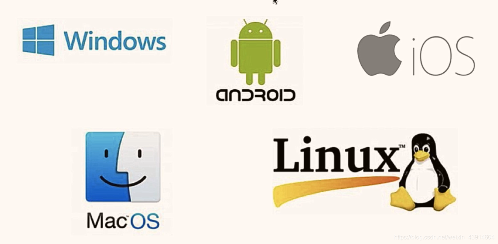
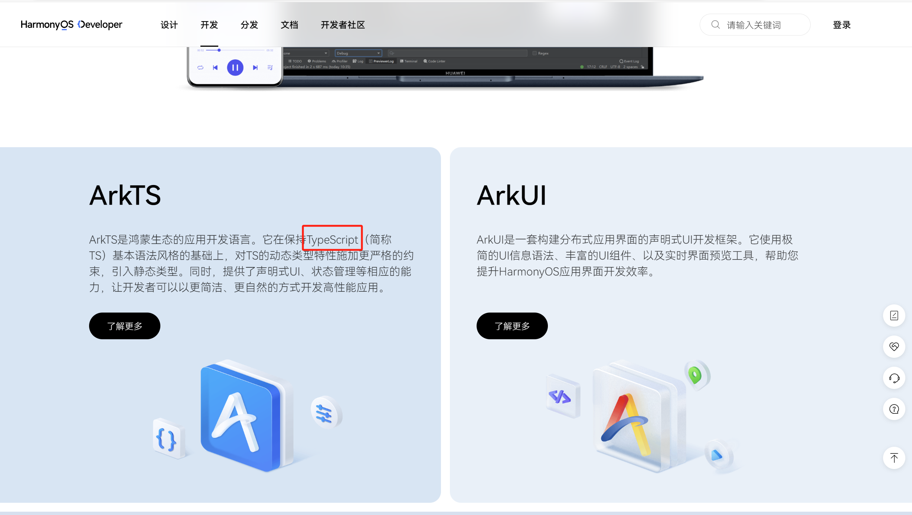

# 操作系统

> 有人就问了，诶我有这些硬件就可以使用了吗？我说不对不对，你光有硬件你会怎么操作它吗
>
> 没有操作系统，用户和程序员需要直接与硬件交互，这意味着对于每种硬件设备，我们都需要了解其具体的技术细节。
>
> 操作系统为我们提供了一个`抽象层`，使我们无需关心硬件的具体实现，就可以使用计算机。

操作系统本质就是一种`软件`，可以理解为所有其他软件的老大哥，所有的软件都要运行在操作系统。底层是用大家熟悉的 `C语言` 写的。

## 一、常见操作系统



Linux 是开源的，但是 windows 和 mac 系统都是闭源的。（开源的意思就是它的源代码它的秘方是**公开且免费**的，所有人都可去看他的秘方！！）

意味着每年这么多台笔记本、手机预装的操作系统，其实这两家公司向用户收取了大量的授权费。

## 二、操作系统霸权

- 而因为所有的软件都要运行在操作系统上，所以操作系统决定了全部软件的生态，**系统生态一旦建立，就可以肆无忌惮地收取渠道费**...

### 苹果税

> 在 iOS 平台上架的应用，产生了应用内消费，比如游戏币充值、购买会员、买皮肤，都必须上缴 `30%`的“苹果税”。这一规则是强制性的，如果开发者私自绕过苹果支付渠道，引导消费者在其它途径充值，比如跳转网页支付，被苹果发现就会下架 APP。
>
> [米哈游欲绕开“苹果税”，厂商与渠道再博弈 - 哔哩哔哩 (bilibili.com)](https://www.bilibili.com/read/cv27048757/)

### 华为为什么要自研鸿蒙操作系统

> - 2018 年 6 月 7 日，美国国会呼吁谷歌停止与华为合作
> - 2019 年 5 月 15 日，美国通过一项国家安全命令有效地禁止了华为
> - 2019 年 5 月 19 日，谷歌公司将华为手机从安卓升级列表中删去
> - 2020 年 5 月 15 日，美国商务部工业与安全局（BIS）官方发布对华为的禁令，宣布将严格限制华为使用美国的技术、软件设计和制造半导体芯片，并在实体列表中增加 38 个华为子公司。
>
> 华为做了什么：
>
> - 2019 年 8 月 9 日：华为鸿蒙系统（HUAWEI Harmony OS）在华为开发者大会（HDC.2019）上正式发布
> - 2023 年 8 月 4 日，华为鸿蒙 4（HarmonyOS 4）正式发布，华为鸿蒙 Next（HarmonyOS Next）操作系统预览版发布！
> - 2023 年 12 月 7 日，支付宝与华为举行鸿蒙合作签约仪式，并宣布将基于 HarmonyOS NEXT 启动支付宝鸿蒙原生应用开发
>
> 国内操作系统生态布局任重道远！虽然你系统有了，但是这么多软件不适配你的系统啊！所以所有的 `APP` 都得重新开发，包括微信、支付宝、淘宝、各种游戏都没有！2023 年底，
>
> [多家企业启动鸿蒙原生应用开发，鸿蒙生态引发连锁效应](https://new.qq.com/rain/a/20231208A07OYB00)

开发这些应用的语言，使用的语言也是我最喜欢语言 `JavaScript` 的超集 `TypeScript` 的超集 `ArkTS`！



## 二、操作系统功能

### 1. 提供用户界面

操作系统提供了用户与计算机交互的界面。

- `图形用户界面（GUI）`，比如`Windows`、`macOS`这些 `toC` 的操作系统。

  其实也支持`CLI`，就是所谓的`终端`，但是有好用的干嘛不用呢？

- `命令行界面（CLI）`，常见于服务器使用的` Linux`系统。

拓展：给大家看看我开发的 CLI 工具！`cs-i18n`（你们那边输入是不行的，必须要安装才行）

### 2. 资源管理

操作系统负责管理计算机的所有硬件资源，包括处理器、内存、硬盘、输入输出设备等。

> 操作系统负责创建、调度其他软件（进程），并决定这个软件需要哪些`硬件`资源。比如：
>
> - CPU 管理，负责处理器（CPU）的分配和管理，确保多个进程`公平有效地`共享 CPU 时间（进程调度）。
> - 内存管理，其实就是在内存中搞一块空间给进程存东西（内存分配、内存回收等）
> - 硬盘管理，比如创建文件、删除文件、修改文件
> - 等等...
>
> 操作系统需要合理分配资源，让每个程序都有足够的资源运行，如果不够，可能就会卡死崩溃闪退捏...

> 为什么C盘一开始就会占用了一些空间？——操作系统占用的

所谓的装系统，其实就是把系统装在`硬盘`（C 盘）里，系统开机时系统加载到`内存`

## 三、软件、程序、进程、线程

### 《原神》是怎样启动的！

> 演示举例：《原神》是如何启动的！
>
> - 找到《原神》安装在硬盘上的位置
>
> - 运行流程图
>
>   ```mermaid
>   graph LR
>       A[硬盘] -->|加载原神| B(内存)
>       B -->|读取指令| C(CPU)
>       C -->|执行指令| D{判断输出类型}
>       D -->|视频信号| E[显卡]
>       D -->|声音信号| F[声卡]
>       E -->|渲染画面| G[显示器]
>       F -->|输出声音| H[音响/耳机]
>          
>   ```
>
> 游戏的读条其实就是游戏场景资源（从**硬盘**）装到内存中

[原神启动素材_哔哩哔哩_bilibili](https://www.bilibili.com/video/BV1Nu4y1z7Gx/?t=13&spm_id_from=333.1350.jump_directly&vd_source=95f170cf9885fc59502f626f2ff81aa9)

### 软件、程序、进程、线程

| 概念 | 《原神》中的例子                       | 说明                                                         |
| ---- | -------------------------------------- | ------------------------------------------------------------ |
| 软件 | 《原神》整体                           | 《原神》作为一个完整的软件。包括游戏程序、音频文件、图像资源、游戏数据和文档等。 |
| 程序 | 《原神》的执行文件（如原神.exe）       | 《原神》的程序是用户可以直接运行的执行文件，包含了游戏的代码和逻辑。 |
| 进程 | 运行中的《原神》实例                   | 当《原神》被启动时，操作系统为它创建一个进程。这个进程包含了游戏代码的执行状态、内存分配和其他系统资源。 |
| 线程 | 《原神》内的图形渲染、音频处理等子任务 | 《原神》进程中包含多个线程，每个线程负责游戏的不同部分，如图形渲染、音频处理、用户输入响应等。 |
