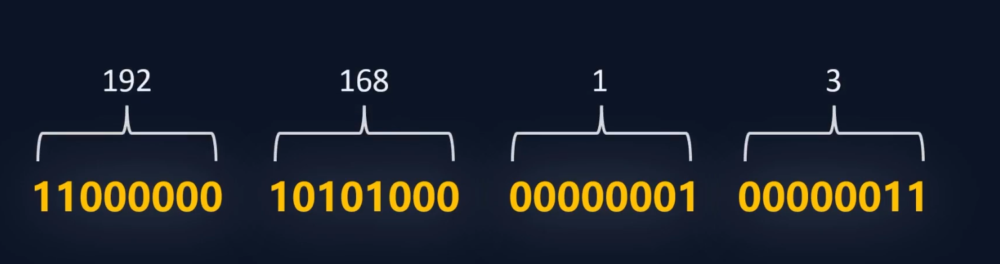

# 计算机网络基础

## 一、快递 vs 网络

计算机网络，主要就是讲数据是怎样传输的。

我们都知道快递是怎样的运输的对吧，假设你从淘宝上买了一个毛毛熊玩具，要把这个毛熊发到你家，需要什么信息呢？那其实数据也是类似的。

- 发货物品
- 发货收货地址
- 联系人电话

| 快递                                                 | 计算机网络                                      |
| ---------------------------------------------------- | ----------------------------------------------- |
| 小熊饼干                                             | 010101010串（数据内容）                         |
| 发货人的物理地址（上海某大厦xxx室）                  | 发送数据的设备的`IP`地址（网络中的发货位置）    |
| 收货人的物理地址（广西某村落xxx号山头）              | 接收数据的设备的`IP`地址（网络中的收货位置）    |
| 中转站点（xxx市物流中心）                            | 路由器                                          |
| 收货人的**电话号码**（通知山头里的哪位靓仔来取快递） | 接收设备的`MAC`地址（设备在局域网中的唯一标识） |

你如果上过计算机网络这门课，你会发现这一章的内容全都是`人为创造规则`！全都是各种协议各种协议，这些协议其实就是约定、共识，只有大家都遵守约定，数据才能被符合期望的传输！（你不给我手机号和地址，我怎么知道发给谁是吧！）

## 二、计算机网络模型

### 1. 两个经典模型

计算机网络中最著名的两个模型是 `OSI（Open System Interconnection 开放系统互连）`模型和 `TCP/IP（Transmission Control Protocol/Internet Protocol 传输控制协议/网际协议）`模型。

1. **OSI模型**：OSI模型由国际标准化组织（ISO）在1980年代初提出，它将网络通信分成七层：物理层、数据链路层、网络层、传输层、会话层、表示层和应用层。每一层都有其特定功能，例如物理层负责传输原始比特流，网络层处理数据包的路由等。
2. **TCP/IP模型**：与OSI模型相比，TCP/IP模型更加**简洁**，通常分为四层：链路层、网际层、传输层和应用层。这个模型是互联网的基础，其核心协议TCP和IP分别位于传输层和网际层。

> OSI模型在设计时非常理想化，试图涵盖网络通信的所有可能方面。然而，它实现起来相对复杂，而且在提出时互联网已经开始采用更简单的TCP/IP模型。因此，OSI模型虽然在理论上很完美，但在实际中并未采用。
>
> TCP/IP是典型的基于实践而不是基于理论
>
> 各个厂商嫌标准协议制定的太慢了。。。管你那么多，先能跑起来再说。（实践是检验真理的唯一标准）

### 2. 模型是干啥的捏？为啥要模型

在计算机网络模型中，每一层都只关注它的特定功能和责任，而不需要关心其他层的具体实现细节。每一层都是对其下一层的`抽象`。（每一层都像是建立在下一层之上的一个`黑盒`，只通过标准化的接口与其他层交互。）这种`层次化`和`抽象化`的设计是为了简化网络通信的复杂性，同时提供灵活性和模块化。

每一层都有各种**网络协议**的，网络协议——为计算机网络中进行数据交换而建立的规则、标准或约定的集合。

### 3. 数据在网络中的打包和运输过程

数据的打包过程——超级类似于快递怎样打包的！

> 简单的类比一下
>
> - TCP首部：这个数据是哪个应用（端口号）发送的，是微信啊，还是原神啊...
> - IP首部：这个数据是从哪里（源IP地址）发到哪里（目的IP地址）啊...
> - LLC首部：这个数据在内部网络中加急还是保密啊...
> - MAC首部：这个数据是哪台设备发送的，是毛毛熊的原神一加胡桃限定版手机啊还是笔记本啊...

你会发现路由器中途并没有拆封是吧！！只是看了看IP知道了要发到哪里

## 三、IP

> 因为计算机网络中每一层各种协议真的太多了，我们就只讲大家最经常听说的`IP`。
>
> 如果你是计算机专业，`HTTP`也必须要好好的了解一下，各种get post方法、常见的请求头响应头，相应状态码。这些是你开发工作几乎每天都是要接触的东西！不知道这些没关系，咱视频不会太深入的捏

IP，也称IP地址，本质就是一串**二进制数字**。IP为	每台联网的设备分配一个唯一的地址。

手机、笔记本、平板、手表、电视等等，只要能联网，都会有一个属于自己的IP地址。

> 举例：192.168.1.3
>
> 
>
> 通常使用32位，嘿您瞧！不就是4个字节吗！（每组0-255）

> 不知道有木有好奇宝宝问：32bit，可以表示 `2^32 = 4294967296`（42亿+）个地址。地球人类都超过80亿了，哪里够啊！

### 局域网和广域网

> 现在假设毛毛熊家里有一台手机，一台笔记本，一台电视，一台打印机，他们都连接了我家路由器。设备们通过路由器连接在了一起。我们将这个网络称之为`局域网`。

而路由器会为每个设备动态分配一个IP！路由器分配的IP称之为——`局域网IP（私网IP）`，这个IP是可以**复用**的！

> 举例：windows 系统通过 `ipconfig` 命令，可以知道目前笔记本局域网IP和路由器IP！

局域网中的设备虽然已经可以互相通信，但是如果毛毛熊要上网刷B站，必须要访问到互联网！

租房的时候打电话给运营商拉过网线，你会发现师傅会从外面连一根网线到你家的路由器上。这时候你的路由器就会获得一个`公网IP`

因为局域网IP是可以复用的，也就是说你的设备每次连接WIFI可能都是不同的局域网IP，但是都会共享同一个公网IP。

每一个家庭、公司、大楼，都是采用这个策略，一定程度上减少了公网IP占用的数量。

## 计算机网络攻击

> DDoS攻击
>
> 某饭店可以容纳100人同时就餐，某日有个商家恶意竞争，雇佣了200人来这个饭店坐着不吃不喝，导致饭店满满当当无法正常营业。**（DDOS攻击成功）**
>
> 老板当即大怒，派人把不吃不喝影响正常营业的人全都轰了出去，且不再让他们进来捣乱，饭店恢复了正常营业。**（添加规则和黑名单进行DDOS防御，防御成功）**
>
> 主动攻击的商家心存不满，这次请了五千人逐批次来捣乱，导致该饭店再次无法正常营业。**（增加DDOS流量，改变攻击方式）**
>
> 饭店把那些捣乱的人轰出去只后，另一批接踵而来。此时老板将饭店营业规模扩大，该饭店可同时容纳1万人就餐，5000人同时来捣乱饭店营业也不会受到影响。**（增加硬防与其抗衡）**

> ARP（地址解析协议，Address Resolution Protocol）是一个重要的网络协议，用于在局域网（LAN）内将网络层的IP地址转换为链路层的物理地址（通常是MAC地址）。它是局域网通信的关键部分，确保数据能够从一个设备传输到网络上的另一个设备。
>
> 
>
> [ARP欺骗攻击](https://www.zhihu.com/question/431822783/answer/1597060562)（正常的路由器有一个网关，通常这个网关是192.168.1.1（看你怎么设置了） ，它是所有网络数据的出口。正常的时候，网关会一直广播给局域网的所有电脑，告诉他们说我就是出口，你们记住我MAC地址，有数据你们发给我，我转送出去（电脑也会一直在局域网不断询问网关的地址）。但是出现ARP欺骗病毒的时候，中了病毒的电脑会一直给所有局域网电脑发数据说，我才是192.168.1.1，你们把数据发我，我来转送出去，而且**广播频率要比路由器高**，当电脑把数据发给中ARP病毒的电脑后就会出现掉线断网的情况。
>
> 之前在交大上网络安全之类的课，有个大作业就是实现ARP欺骗攻击，最后我们成功的把一台电脑原本访问的复旦某个网站变成了交大的网站...好好好
