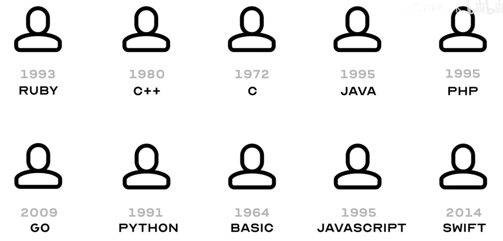

编程语言，其实就是俗话说的代码！你可能没见过代码，但是你无时无刻都在和代码打交道。底层的操作系统，顶层的各种软件，微信、PS、word。每天的原神启动！甚至B站啊、各种小电影的网站都是代码写的

## 一、自然语言、编程语言、机器语言

### 自然语言和编程语言

- 自然语言：实现人与人之间沟通。（汉语、英语、日语、德语、法语...）

- 编程语言：实现人与计算机之前沟通的一套`人为创造的规则`（编程语言是一种用来**与计算机沟通**的形式化语言。它是一套**人类创造的指令和规则**，用于告诉计算机如何执行特定的任务。简单说就是告诉计算机它要干啥捏。）

  

> 简单让GPT写一段简单的JS代码。然后转换成其他语言（python、c++）的代码。
>
> 发现他们都是由一些简单的英文字符和数学符号组成的。不同的计算机语言，会因为语法不同，有一些差异。但是都是各种变量、常量、对象、条件、循环、函数组成。

### 机器语言

一个通常的人类往往只掌握一两种语言、母语、方言，甚至外语。

计算机它认识这么多编程语言吗？NO！计算机只认识一种语言——机器语言

- 机器语言：机器语言是最接近硬件的编程语言。它直接由0和1组成，代表了计算机硬件操作的基本指令。


> 你说为什么有了机器语言，还需要编程语言呢？，就回到之前的二进制那门课中，我给你发一串0101你读得懂呢！同样的你让人类用0101来写代码真的太强人所难了！！！
>
> 笑话：能独立手写 Windows 的程序员是什么水平？ - Rinchan 的回答 - 知乎
> https://www.zhihu.com/question/423054941/answer/1594934359

就好像人类世界中会有专门的翻译，计算机世界中也有专门用来把非二进制代码转换为二进制代码的程序——**编译器（解释器）**

| 编程语言 | 编译器/解释器          | 应用场景                                     |
| -------- | ---------------------- | -------------------------------------------- |
| C/C++    | GCC, Clang, Visual C++ | 操作系统、嵌入式系统、性能密集型应用         |
| Java     | JDK                    | 企业级应用、安卓应用开发、大数据技术         |
| Python   | CPython                | 数据科学、人工智能、网络开发、教育           |
| JS/TS    | Node.js                | 网页开发、全栈开发、移动应用开发、小程序     |
| C#       | .NET编译器（如Roslyn） | 游戏开发（特别是Unity引擎）、Windows应用开发 |
| Go       | Go编译器               | 云计算、服务器编程、分布式系统               |

## 二、搭建JS编程环境

下面我就以JS为例，一步一步带你搭建一个JS的运行环境！（代码要跑起来）

###  1. Node.js安装

搜nodejs，安装

### 2. IDE安装

IDE（集成开发环境）是一种强大的软件应用程序，它为软件开发人员提供了一个集成的环境，以便更高效地编写、测试和调试代码。（你当然可以用记事本编程！）

推荐VSCode，别听学校安装那什么codeblocks，多少年的老古董了。这就是信息差兄弟们！业界在用什么编辑器。

### 3. 开始跑代码啦

## 三、彩蛋

最后给大家留一个彩蛋！两个命令！利用你的信息检索能力找到最终答案吧！计算机专业最重要的就是信息检索能力。

```
npm i -g mmxdashuaige
```

```
mmxdashuaige
```


