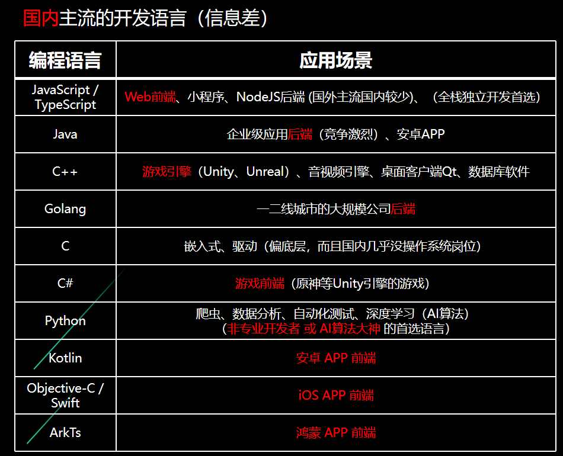
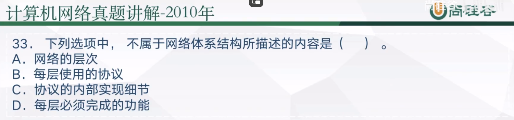

欢迎来到重要信息差这一章！

经过了上面的课程。我已经帮你速通了国内本科的计算机`最有用`的计算机知识。对的没错，甚至讲的比99%的大学老师都要好了。

你说啊怎么一点都不硬核，真正硬核的东西多了去了，人不可能有这么多的时间精力去钻研每一门课程。这门课我做的最重要的事就是给你开视野，让你知道自己的学习方向，而不是什么像在大学一样都学一点最后啥也不会。

> 计算机专业如何找到好工作！
>
> 1. 科班思维
>
>    大学教学质量极差，90%的科班学生四年下来都没搭建好一套体系...在脑海里都不清楚为什么计算机是0和1，什么是IP什么是端口。你让他说为什么计算机能计算1+1=2也不知道。包括编程，老师不会告诉你变量在内存中是怎样保存的，因为大学只有C语言一门编程语言，而且还是在计算机组成还没学到之前就上了编程语言这门课！
>
> 2. 路线方向
>
>    这非常重要，这也是大学所欠缺的地方，也就是信息差！大家都听过选择比努力重要！
>
>    你敢信交大计算机，前端后端是什么，没有一个老师提过。。。我到了大三都完全不了解这些工程概念。这真的非常可怕。连工作岗位都不知道怎么找工作呢？大学不教，毛毛熊告诉你。
>
> 3. 工程能力
>
>    剩下的1/3就是你在这个方向上的`工程能力`，这个只能靠你自己积累。我会在下一章中分享一下我的工程能力是怎样搭建的。

## 路线方向！本章重点！

首先你要知道，计算机类专业不是按部就班上课就能找到好工作的，甚至所有科目考满分都没多大用。

如果你觉得计算机学的很迷茫，根本不知道要学什么。迷茫就对了，因为所有的大学，我敢说包括清华北大，就是路线方向和工程能力，完全没有一点点培养。如果我能早点放弃竞争保研我恨不得大一的时候开始每一门考试都考60分，早点有人告诉我有什么方向然后努力！

相信我，如果你是大一大二的计算机类学生，接下来的课程可能将会改变你的一生。从0到1，如何建立自己的路线方向。

> 计算机路线方向公式
>
> 1. 选方向学语言
> 2. 刷leetcode
> 3. 学markdown和git
> 4. 学框架，做项目
> 5. 投实习

### 1. 选方向学语言

如何确定自己的方向，我教你们一招——`面向岗位学习`

去招聘网站看看现在都有哪些岗位！然后不断地搜索这个岗位是干嘛的！很多计算机学生直到大四秋招才开始第一次接触招聘网站！晚啦！别人知道信息差的都对这个工作要掌握什么技能都非常熟练了。你这时候才开始准备起步，哪怕你绩点拉满奖学金爆炸，面试官想捞你都难，因为他们也知道大学课程的含金量，他们更加看重的是你的岗位技能而非学习成绩。（当然学习成绩好可以锦上添花，但是如果你连技能都没，对不起，没人要你。）

> 演示一波怎么找岗位：牛客网或者BOSS直聘上面，可以发现对应的岗位分类！ok剩下的就是检索这些岗位所需的语言
>
> 千万要注意人工智能这个专业，通常需要硕士学历，并且基本上必须要985硕士+顶会论文。比如我大学时期同计算机专业保研的朋友，我问他现状如何他说他给自己弄进去了。弄进去了怎么搞的好像坐牢一样。
>
> [应届生求职网站_最新更新校园招聘/实习机会/内推资讯_牛客网 (nowcoder.com)](https://www.nowcoder.com/jobs/recommend/campus)

你方向选好之后，你已经超过了大部分大一新生了

编程语言一定一定要系统地学习，怎么学呢？万能的B站！

> 演示一波如何找到免费的语言教程

怎么不教我们编程啊毛毛熊。我这么和你说吧，我起码得教你一个学期，你都不一定能把这个语言吃透。所以我不会在这里你们这些课程，因为B站的老师讲的比我好，这和速通课的初衷就本末倒置了，我能告诉你们信息差即可，让大家不要走弯路。虽然我有能力讲的比所以大学老师都好，但是这整个体系耗费的精力太多了，除非我辞职全职搞这些，不然是没时间的。

很多大学就只教你那一个C语言，有个屁用啊！！！你千万不要光学那一个C语言就完事了。偷偷告诉你们，C语言工作岗位是非常少而且很底层的，而且学习成本也很高。所以看到B站一些萌新计算机宝宝天天拿着那古董IDE捣鼓C语言就觉得很好笑，天天就只知道一个C语言，你看看C语言国内环境能不能找到工作啊！当然C语言一般都是大佬用的，比如操作系统这种垄断性产品的底层就是C。

还有人跟风学`python`，你这不是瞎学吗？方向大于努力。你知道为什么这么多培训班都喜欢教 python 吗？？因为它好教啊，最简单的语言。但是你要用他找工作，一般就数据分析、算法这种岗位，岗位很少，尤其是算法，至少要985研究生+顶会起步。所以方向没找好那不就是瞎努力吗！

> 还有就是很多时候学习路线这种，你们一定不要请教自己的同学，因为他们可能是在故意装逼害你。每个同学的方向都不一样，都是根据自己的兴趣来的。而有些装逼人士就是故意让你听不懂，显示自己的专业性，保持自己专业的神秘性，人为加强难度。
>
> 萌新：我想知道什么是算法
> 装逼犯：算法导论，一定要看英文版
>
> 萌新：高数如何不挂科
> 装逼犯：吉米多维奇全做完
>
> 萌新：如何提高英语
> 装逼犯：牛津字典背会了没
>
> 萌新：如何学计算机
>
> 装逼犯：英文原版的CSAPP看完，c++ primer看完。真的我觉得除非你时间很多否则看书的成本太高了。书籍的知识具有滞后性！你学习上课的时候可以看没问你，但是现在就业市场这么恶劣真的没必要花太多时间钻研这些古董。

### 2. 刷leetcode

搜索 `leetcode`，开刷！你毕业之前起码要把100道题都给刷对了。因为一般大厂的面试题都会有一个手撕算法的题目，他们都是从`leetcode`里出的题。100道题完全够用了。

> 我试一下现场刷一道题，看看是否宝刀未老

刷leetcode其实就是培养你对数据结构和算法的敏感度，以及对语言的熟练度！

### 3. 学markdown和git

markdown 和 git 这两个是计算机人必备的东西。但是大学完全不教你。真的就离谱。

> markdown就是一个笔记格式，推荐用`typora`，这个我没找教程，就是自己琢磨着就学会了。而且一般每个仓库都会附带一个markdown文件，就是用来说明这个库是干什么的

> git，就是版本控制工具，是一个软件。这个玩意比较抽象，不太好学，必须要实操过几遍之后就发现其实也不难！
>
> 举例：演示一下修改git之后推送到自己的仓库
>
> GitHub、Gitee和Git之间的关系可以通过一个类比来理解：
>
> 1. **Git**：想象Git是一种照相机技术。就像照相机可以用来拍摄和存储照片一样，Git是一个工具，用于“拍摄”（即记录）你项目代码的不同“快照”（即版本）。Git是一个版本控制系统，它帮助你跟踪和管理代码随时间的变化。
> 2. **GitHub**：如果Git是照相机，那么GitHub就像是一个在线相册服务。就像你可以上传照片到云端相册，与家人和朋友分享，GitHub是一个在线平台，让你存储你的代码（Git仓库），并且与他人协作。GitHub为Git提供了一个可视化的界面和额外的协作特性，比如问题跟踪、代码审查和团队管理工具。
> 3. **Gitee**（也称为码云）：Gitee与GitHub类似，它也是一个在线平台，提供了存储和分享Git仓库的功能。Gitee更多地面向中国市场，提供了类似GitHub的功能和界面，但它在中国大陆的访问速度更快，且提供了一些本地化的服务。
>
> 简单说Git是一个软件，而GitHub和Gitee是使用这个工具的在线平台，也就是云端仓库，使得使用Git进行版本控制和协作变得更容易和高效。

> 我推荐计算机科班生一定要建一个自己的代码仓库，然后把自己的所有大作业都放进去！不管你电脑怎么换，以后直接一个git clone 下来。
>
> （演示一下我的gitee）说到git，我就对我之前代码用百度网盘保存了一年的代码感到好笑哈哈哈哈！这样面试你直接贴一个仓库地址，直接秒杀90%的同龄人，他们甚至都没有自己的代码仓库！
>
> 这玩意甚至很多文职生在公司也要求会用。方便的管理公司内部的各种文件。

markdown和git 虽然在计算机速通课里面没有重点介绍。但是我估计后续会再出一套拓展教程，介绍人工智能、git和markdown等等速通课没有提到的方面。敬请期待！

### 4. 学框架，跟练项目

框架是什么：**框架**（Framework）是一种用于软件开发的**抽象结构**，它提供了一种在其上构建应用程序的基础。框架通常定义了应用程序的整体结构、提供了一组预先定义的功能或类，并指导了特定任务的编程方式。它旨在减少开发时间和成本，同时提高软件的质量和可维护性。

> 其实框架，就是别人写好了包装起来的一套工具，把你原先必须要写的，必须要做的一些复杂的东西都写好了放在那里，你只要调用他的方法，就可以实现一些本来要费好大劲的功能。
>
> 形象一点说吧，假如你盖房子，你是自己一砖一瓦的盖简单呢，还是拿一个现成的架子往上面添东西简单呢？结果不言而喻吧，有一个半成品的架子，你只需要添上一些你自己额外需要加的东西就好了。这就是框架的好处。
>
> 有了打火机，就不需要再准备砖木取火准备各种材料...

你要学什么框架，取决于你的求职方向，和之前一样面向就业岗位学习，不要雨露均沾，要精！大学框架是一点都不教，而基本上工作中处处是框架，不会框架肯定找不到工作，这又是一个信息差！请记住一定不要只学不练！一定要去自己尝试多写代码，比如你的方向是前端，你就试着自己把B站主页给复刻出来。

### 5. 实习

这个学校也不会主动给你提供，必须要自己去找，又是信息差没想到吧

> - 关注各公司招聘公众号，一般上学期开始就会陆续放出实习名额，不抢就无了
> - 实习僧、牛客网等等

计算机专业，记得牛客网找面经！！！

## 计算机专业最重要的课程

大学的计算机专业最重要的课程只有4门：计算机组成、数据结构、操作系统、计算机网络。也是计算机考研的 4 门课，另外再加一门数据库。其他的课程什么高数啊线性代数概率统计这些，如果你打算读研打算学人工智能的话才要好好学。至于其他的课程完全都是空中楼阁。

而这四门课，你如果发现自己的老师讲的很差听不懂，没关系是老师的问题。请立马去搜网课找替代！！！你每次都坐最后一排然后嘎嘎刷最好的网课，如果你想考研，你就直接搜考研课程直接看，那更是针对性非常强。

请记住在大学上课大概率是浪费时间，听质量更好的网课取代即可！

|                |                             国内                             |       国外（B站可以搜到）        |
| :------------- | :----------------------------------------------------------: | :------------------------------: |
| 入门           |                     毛毛熊的计算机速通课                     |           Havard CS50            |
| 数据结构和算法 | [数据结构与算法基础（青岛大学-王卓）_哔哩哔哩_bilibili](https://www.bilibili.com/video/BV1nJ411V7bd/?spm_id_from=333.337.search-card.all.click&vd_source=95f170cf9885fc59502f626f2ff81aa9) |    UCB CS61B: Data Structure     |
| 计算机网络     | [中科大郑烇、杨坚全套《计算机网络（自顶向下方法 第7版，James F.Kurose，Keith W.Ross）》课程_哔哩哔哩_bilibili](https://www.bilibili.com/video/BV1JV411t7ow/?spm_id_from=333.337.search-card.all.click&vd_source=95f170cf9885fc59502f626f2ff81aa9) | Stanford CS144: Computer Network |
| 操作系统       | [王道计算机考研 操作系统_哔哩哔哩_bilibili](https://www.bilibili.com/video/BV1YE411D7nH/?spm_id_from=333.337.search-card.all.click&vd_source=95f170cf9885fc59502f626f2ff81aa9) |        我没看过就不强推了        |
| 数据库系统     | [【自用】数据库系统概论学习_哔哩哔哩_bilibili](https://www.bilibili.com/video/BV1W3411y7dw/?spm_id_from=333.337.search-card.all.click&vd_source=95f170cf9885fc59502f626f2ff81aa9) |   CMU 15-445: Database Systems   |

如果还没上过这些课，可以学国内和国外任选其一，英文不好建议国内。如果要考研，建议国内。如果要出国，建议国外。如果没时间，只需看入门即可！

### 大学课程对工作并无帮助

但是你要说这 4 门课对于求职有用吗，其实也没有，他们只是给你一个计算机这门学科的概念在你脑子里。有了这个思维模式，能帮助你更加理解整个系统是如何运转的，也就是培养你的科班思维。如果你以后要去深造之类的要读研，那么必不可少。而且我已经帮你速通了，甚至教的比大学老师还好。剩下的就是靠你去学去练！

> 我觉得大学教育之所以这么没用，就是因为他们**太注重考试而不是工程能力的培养**。举个例子计算机考研的真题：
>
> 

考试考的是记忆能力，但是计算机学科靠的更多是，查阅能力，检索信息的能力。

现实世界中从来没有哪一个工作，是要求你去背诵的，要你把这个代码背下来，而是不会的就去搜索去学习。所以说，大学考试绩点的本质其实是和社会实践相悖的。就像那个什么一站到底之类的知识栏目。虽然他们知道的很多很多，但是实际上，根本不会有人买你背诵的知识，为什么，因为互联网上一搜索都有，他们根本创造不出价值！

计算机的关键词是抽象，它就是减少人类再进行繁琐冗杂的无意义操作。我们建设数据库，就是为了记录下那些知识，然后随用随取。怎么还考察你背诵记忆的能力呢？真正的创造创新都不会来自死记硬背。

你要知道计算机专业真正的实力，就是项目、工程、实习。最后的一节课，我会分享给你我的工程能力是如何搭建的。
