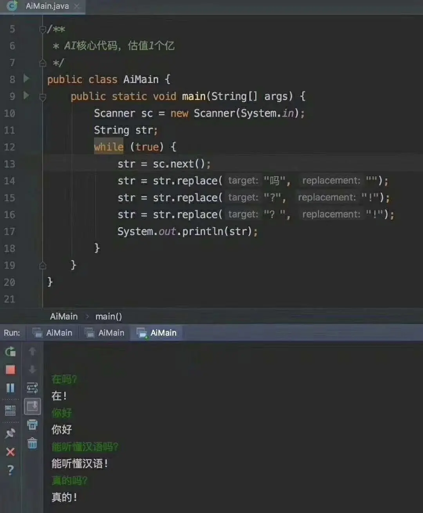
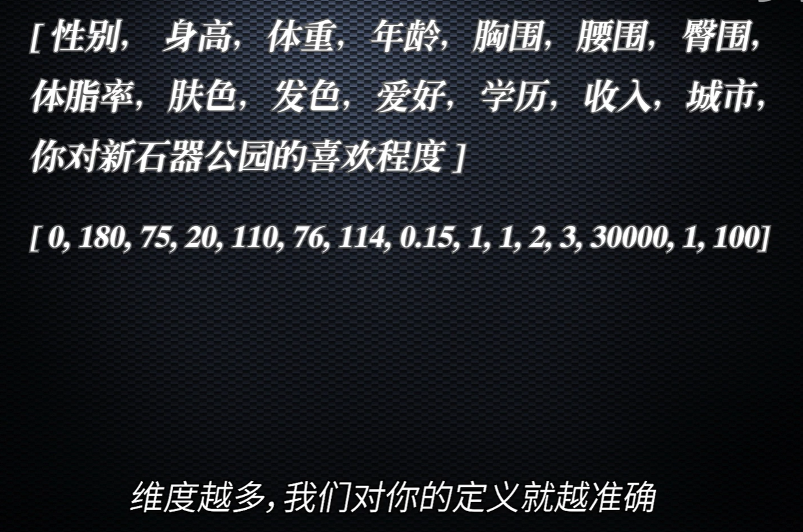

我听过一个比喻很好，人工智能就是当代的珍妮纺织机，注定要彻底改写人类未来。AI 的应用范围广泛，包括图像处理、自然语言处理、语音识别和合成等领域。

> 简单的人工智能
>
> 

小小吐槽：我尽我的可能将这节课讲好。因为交大没有一个老师教过这方面的基础...他们都是上来就默认你会的，我表示不理解啊！！！为什么课程难度设置的这么高，又连基础都不带教...于是我只能自学。

### 二进制与信息处理

通过二进制那节课，我们知道了计算机的底层就是二进制。不论是 abcd 这些文字也好，或者是图片也好，他们最终都是一串 01010101。但是这种记录会存在一个问题！电脑不能不能把数字和它实际表示的东西建立联系。

- 在非人工智能时代，计算机只是我们存储和处理信息的一种工具。计算机它内部的并不需要知道这些 010101 是啥意思，它只要会机械麻木只要插上电的计算就足够了。具体要做什么处理，都是人类通过编程，编程转换成指令告诉计算机的。
- 在人工智能时代，我们需要电脑自己处理这些信息。那么怎样让计算机“理解”数据呢？！

### 向量化：让计算机理解世界

电脑是不能理解自然语言的，它只认识 010101。比如你想描述一个人，你就只能尽可能的用一系列数字来描述，你要表示一个男性，【0，180，75，20，】0 表示男性，180

如果你觉得这样的表示太简单了，根本不能标识出这个人。可以增加维度，纬度越高，计算机对这个人的定义就越准确。

你如果将所有人都这样表示出来后就会发现。在高维空间中，类似的对象（如类似的图片或具有相似含义的词语）会在向量空间中靠近彼此。

- 图像识别，比如手写数字识别上，在这个维度上同样的数字 7，都会拐个弯
- 自然语言理解，美丽、帅气，词形维度上他们都是形容词、都是褒义词，从是否可以形容人的维度上，他们都可以形容。

为什么要向量化呢！！！以为计算机可以快速的计算向量！！

### 训练：教会计算机识别和理解

训练是人工智能的一个重要环节。我们通常通过大量数据来训练模型。这些数据被标记好了正确答案。

> 你可能好奇这些正确答案是怎么来的，没错！人工标记的！
>
> 数据标注员：[千亿 ChatGPT 的狂欢和月薪 3K 的数据标注员 - 知乎 (zhihu.com)](https://zhuanlan.zhihu.com/p/610831441)
>
> 其实一些验证码也是在白嫖我们标注数据，有时候你会发现它明明对了但是还是要再验证一次是吧，其实第一次就是给你正确答案，第二次让你来标注数据。

我们就要找到一个尽可能完美的 y= fx 的函数。比如图像二分类判断一个图片是不是猫，对于输入的图片数据，要返回 1 表示是，0 表示不是。

我们设定一个函数 y= fx ，它的目的是从输入 x（比如图片数据）预测输出 y（比如是否是猫）。训练的过程，实际上是让计算机通过反复的计算，不断调整  fx 中的参数，使得预测结果尽可能接近真实标签。

这个 y = fx 的函数里面人类会随机设置了大量的参数！为啥随机呢？一开始人类也不知道这个函数是什么样子的，要计算机自己不断地找出这个函数！（是不是有点类似于自己制造自己了）

> 这个fx你可能听说过，没错，就是神经网络。它是一种受人脑启发的计算系统，神经网络是由大量相互连接的节点（或称“神经元”）组成的，每个神经元都携带一些参数，可以简单理解为 `y = ax+b` 的 a和b 。

每一次计算之后的结果和会有差距！我们通过数学方法（损失函数）衡量预测结果和真实结果之间的差异！然后让计算机不断地调整自己的参数，通过优化算法，计算机会逐步调整参数，以减小这个差异。理想情况下，经过充分的训练，模型将能够准确地进行预测。

> 其实这就是人工智能包括 GPT 的基础原理！但是你要求学会高等数学、线性代数、概率统计等等知识。
>
> 翻开《吴恩达老师的深度学习》你如果真的把知识学透然后理解了它的过程之后你就会发现，amazing 啊！！人类怎么这么聪明啊我靠！！！就是整个过程就是人类通过各种神奇巧妙的方法，让损失函数变成一个凹函数，然后就能通过求导不断地逼近这个凹函数的最小值了，也就是这时候的参数，让所有的输出和正确答案的差距变到最小！